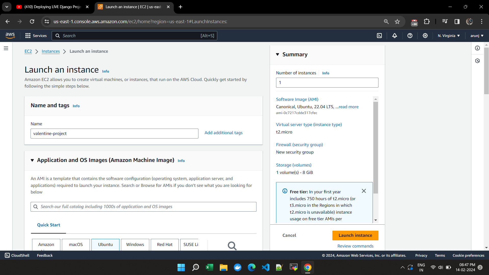
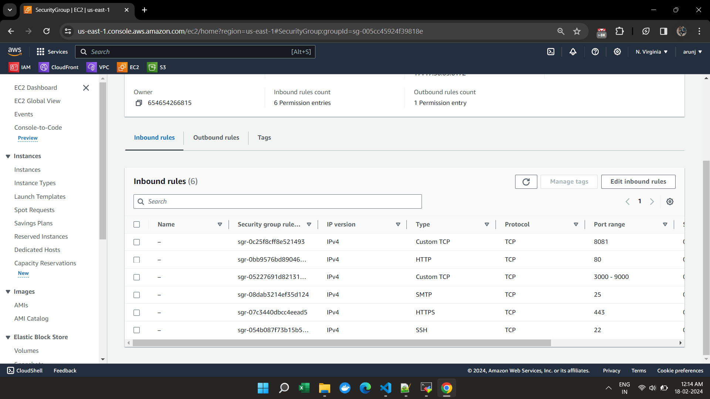
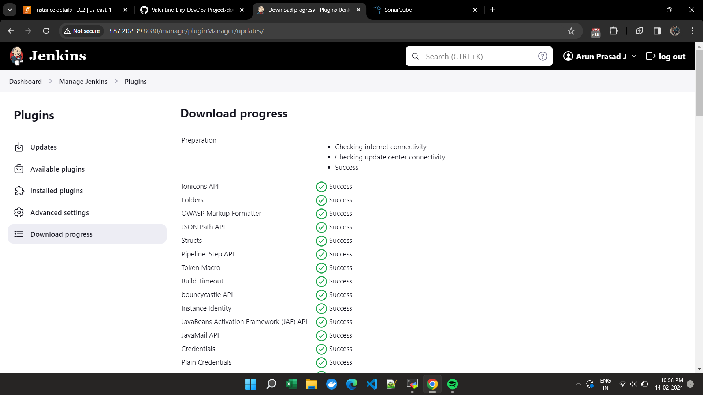
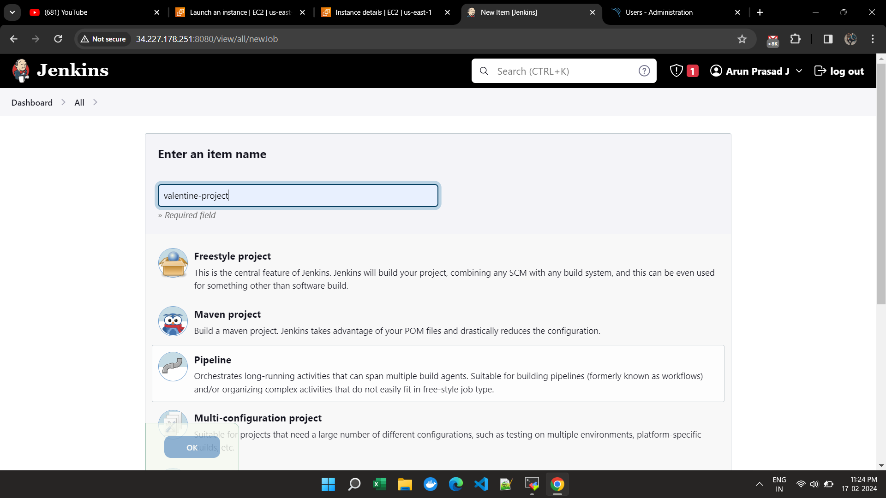
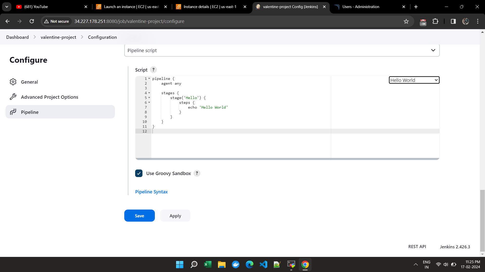
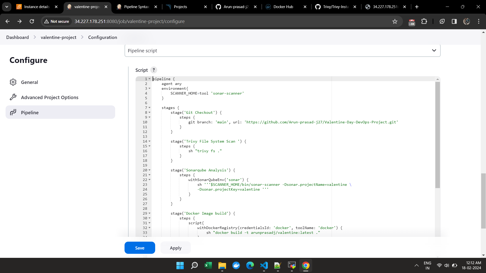
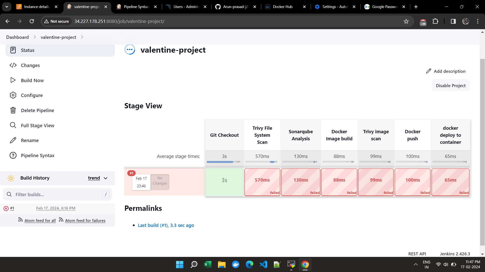
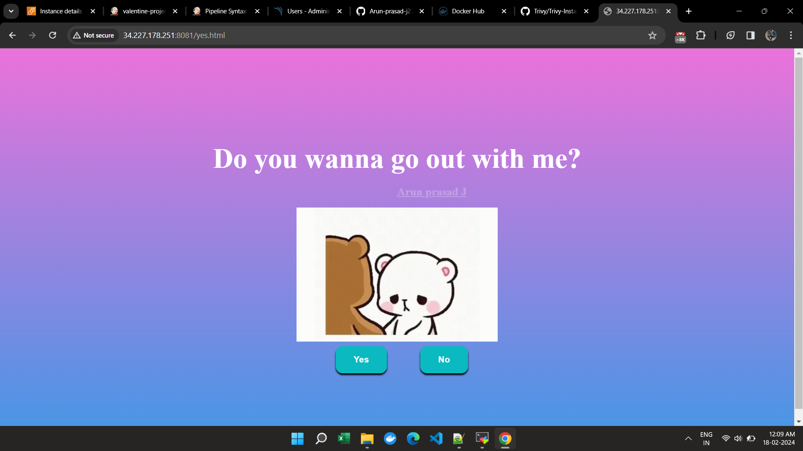
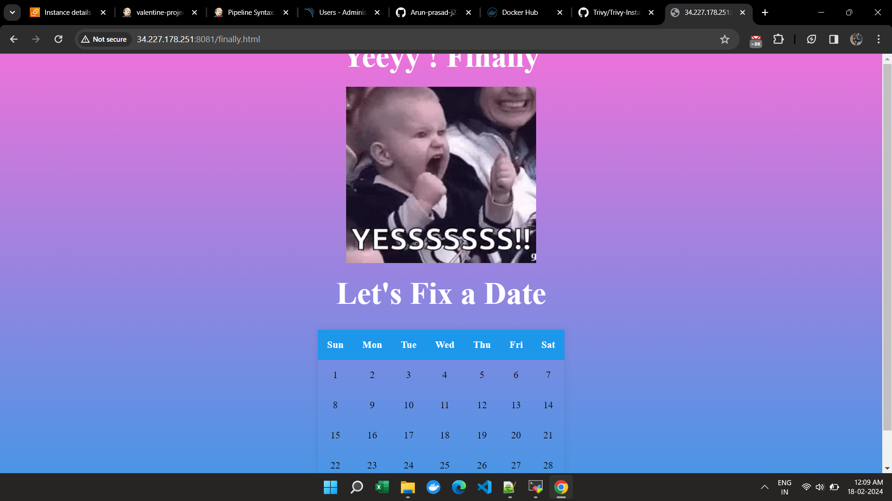

# Valentine-DevOps-project

This project guide outlines the steps to set up an AWS EC2 instance with Ubuntu 22.04, install Jenkins, Docker, Trivy, configure Jenkins plugins, set up SonarQube, and create a pipeline for a sample project.

## Table of Contents
1. [AWS Instance Setup](#aws-instance-setup)
2. [SSH into Instance](#ssh-into-instance)
3. [Install Jenkins and Docker](#install-jenkins-and-docker)
    - [Installing Jenkins](#installing-jenkins)
    - [Installing Docker](#installing-docker)
    - [Configuring Docker Permissions](#configuring-docker-permissions)
4. [Configure Jenkins Plugins](#configure-jenkins-plugins)
5. [Setup SonarQube](#setup-sonarqube)
6. [Create Jenkins Pipeline](#create-jenkins-pipeline)
7. [Run Project](#run-project)

## 1. AWS Instance Setup

Create an AWS EC2 instance with the following specifications:
- Instance Type: t2.medium
- AMI: Ubuntu 22.04
- Key Pair: [Provide Key Pair]
- Security Group: Open ports 22, 443, 80, 3000-9000, 8081

Launch the instance.




## 2. SSH into Instance

Use MobaXterm to SSH into the AWS instance using the following command:

```bash
ssh -i /path/to/pemfile ubuntu@public_ip_address
```

Replace `/path/to/pemfile` with the location of your PEM file and `public_ip_address` with the public IP address of your AWS instance.

## 3. Install Jenkins, Docker and Trivy

### Installing Jenkins

```bash
# Update package index
sudo apt update

# Install Java
sudo apt install default-jdk -y

# Install Jenkins
wget -q -O - https://pkg.jenkins.io/debian-stable/jenkins.io.key | sudo apt-key add -
sudo sh -c 'echo deb https://pkg.jenkins.io/debian-stable binary/ > /etc/apt/sources.list.d/jenkins.list'
sudo apt update
sudo apt install jenkins -y

# Start Jenkins service
sudo systemctl enable jenkins
sudo systemctl start jenkins
sudo systemctl status jenkins
```

### Installing Docker

```bash
# Update package index
sudo apt update

# Install Docker
sudo apt install docker.io -y

# Start Docker service
sudo systemctl start docker
sudo systemctl enable docker

# Verify Docker installation
sudo docker --version
```

### Configuring Docker Permissions

```bash
# Change permissions for Docker socket
sudo chmod 666 /var/run/docker.sock
```

This command grants all users read and write access to the Docker socket.

### Installing Trivy

```bash
sudo apt-get install wget apt-transport-https gnupg lsb-release

wget -qO - https://aquasecurity.github.io/trivy-repo/deb/public.key | gpg --dearmor | sudo tee /usr/share/keyrings/trivy.gpg > /dev/null

echo "deb [signed-by=/usr/share/keyrings/trivy.gpg] https://aquasecurity.github.io/trivy-repo/deb $(lsb_release -sc) main" | sudo tee -a /etc/apt/sources.list.d/trivy.list

sudo apt-get update

sudo apt-get install trivy
```

## 4. Configure Jenkins Plugins

After accessing Jenkins on your web browser, go to "Manage Jenkins" > "Manage Plugins" > "Available" tab, and install the following plugins:
- Docker
- Docker Pipeline
- Docker Build Step
- SonarQube Scanner



## 5. Setup SonarQube

1. Run the SonarQube Docker container:

```bash
docker run -d --name sonarqube -p 9000:9000 sonarqube:lts-community
```

2. Access SonarQube through your web browser using the public IP address of your instance followed by port 9000 (e.g., http://public_ip_address:9000).

3. Generate an authentication token in SonarQube:
   - Go to Administration > Security > Users
   - Select your user
   - Click "Generate Token" and note down the token.

## 6. Create Jenkins Pipeline

Create a new pipeline job in Jenkins with the provided script.









## 7. Run Project

1. After the pipeline is built, click on "Build Now" to execute the pipeline.

2. All the stages will be executed, and the pipeline will be successful.

3. Run the project through the public IP address of your instance followed by container ID and port 8081 (e.g., http://public_ip_address:8081/yes.html).





---